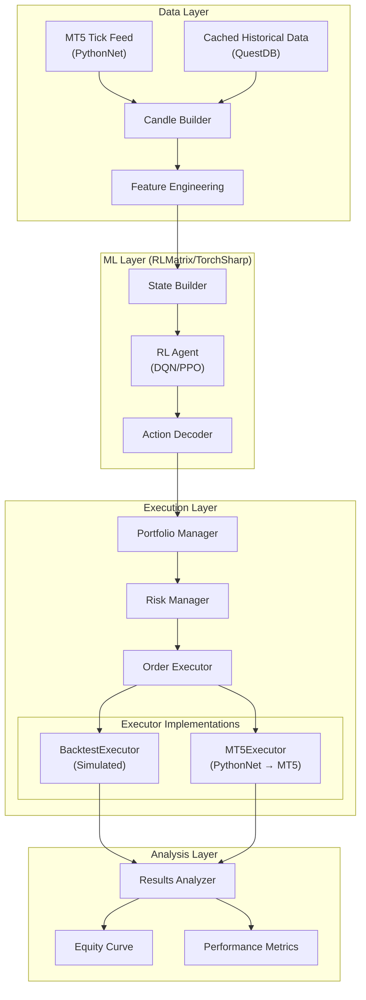
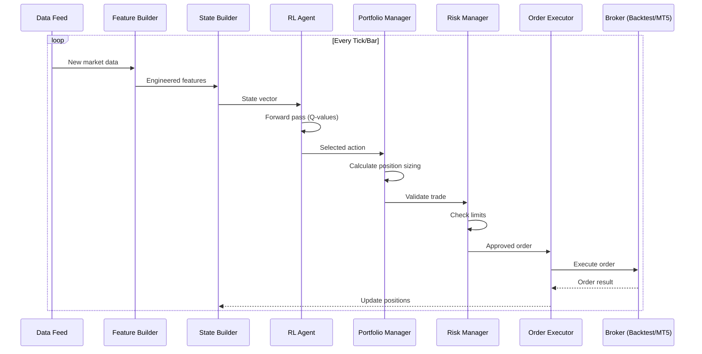
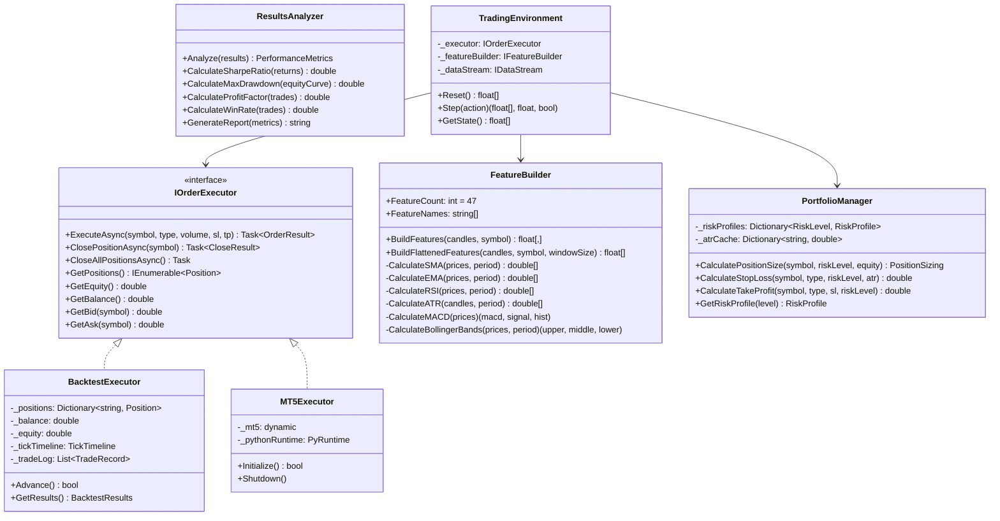
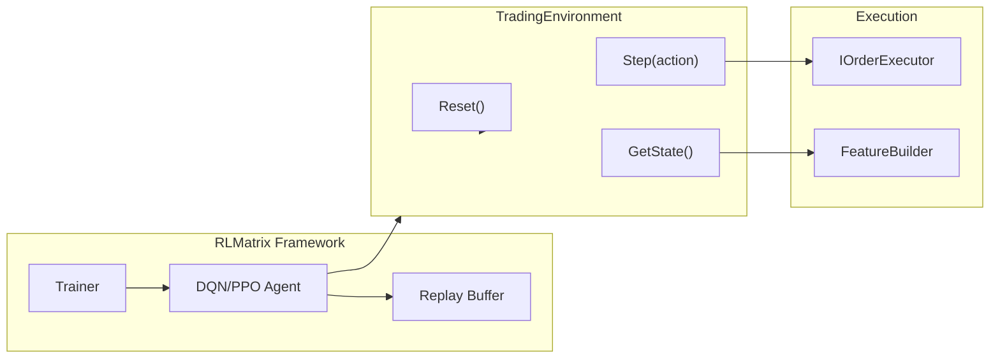
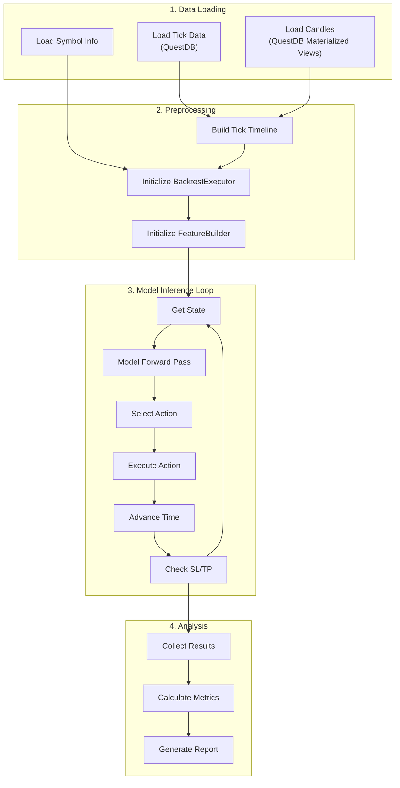
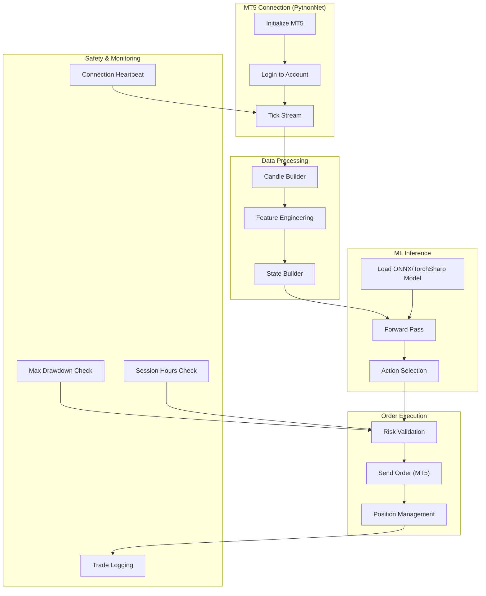
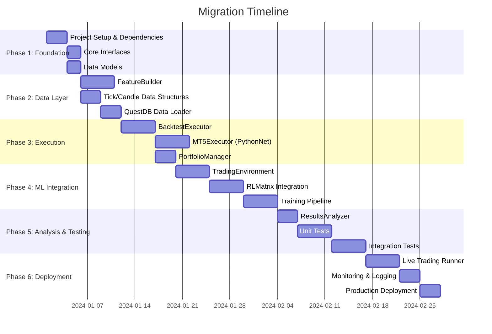

# ML-Only Portfolio Management System Design

## Overview

This document describes the architecture for migrating from a multi-strategy Python trading bot to a .NET-based ML-only portfolio management system. The ML model becomes the sole decision maker, eliminating custom strategy logic (TrueBreakout, Fakeout, HFT strategies).

**Key Technologies:**
- **RLMatrix** - TorchSharp-based RL framework for .NET (DQN Rainbow, PPO, GAIL)
- **TorchSharp** - .NET bindings for PyTorch
- **PythonNet** - Embed Python runtime for MT5 API access
- **ONNX** - Model interchange format (optional)

---

## 1. System Architecture Overview

### 1.1 High-Level Architecture Diagram



### 1.2 Component Interaction Flow



### 1.3 Data Flow Summary

| Stage | Input | Output | Component |
|-------|-------|--------|-----------|
| 1. Data Ingestion | Raw ticks/candles | OHLCV DataFrame | DataFeed |
| 2. Feature Engineering | OHLCV DataFrame | 47 normalized features | FeatureBuilder |
| 3. State Construction | Features + Portfolio | State vector (float[]) | StateBuilder |
| 4. Model Inference | State vector | Q-values / Action probs | RLAgent |
| 5. Action Selection | Q-values | Discrete action (0-7) | ActionDecoder |
| 6. Position Sizing | Action + Risk profile | Volume, SL, TP | PortfolioManager |
| 7. Risk Validation | Order params | Approved/Rejected | RiskManager |
| 8. Order Execution | Order params | OrderResult | OrderExecutor |

---

## 2. Core Interfaces and Abstractions

### 2.1 IMarketState - State Representation

```csharp
namespace Ougha.Trading.Core.Abstractions;

/// <summary>
/// Represents the current market state for ML model inference.
/// Contains all information needed for the RL agent to make decisions.
/// </summary>
public interface IMarketState
{
    /// <summary>
    /// Normalized feature vector for model input.
    /// Includes market features, portfolio state, and symbol embedding.
    /// </summary>
    float[] Features { get; }
    
    /// <summary>
    /// Current open positions by symbol.
    /// </summary>
    IReadOnlyDictionary<string, Position> Positions { get; }
    
    /// <summary>
    /// Current account equity in base currency.
    /// </summary>
    double Equity { get; }
    
    /// <summary>
    /// Available margin for new positions.
    /// </summary>
    double FreeMargin { get; }
    
    /// <summary>
    /// Current timestamp (simulated or real).
    /// </summary>
    DateTime Timestamp { get; }
    
    /// <summary>
    /// Symbol being evaluated (for multi-symbol training).
    /// </summary>
    string Symbol { get; }
    
    /// <summary>
    /// Numeric symbol ID for embedding lookup.
    /// </summary>
    int SymbolId { get; }
}
```

### 2.2 IOrderExecutor - Order Execution Abstraction

```csharp
namespace Ougha.Trading.Core.Abstractions;

/// <summary>
/// Abstract interface for order execution.
/// Implementations: BacktestExecutor (simulated), MT5Executor (live via PythonNet).
/// </summary>
public interface IOrderExecutor
{
    /// <summary>
    /// Execute a market order.
    /// </summary>
    /// <param name="symbol">Trading symbol (e.g., "EURUSD")</param>
    /// <param name="type">BUY or SELL</param>
    /// <param name="volume">Lot size</param>
    /// <param name="sl">Stop loss price (0 = none)</param>
    /// <param name="tp">Take profit price (0 = none)</param>
    /// <param name="comment">Order comment for tracking</param>
    /// <returns>Order execution result</returns>
    Task<OrderResult> ExecuteAsync(
        string symbol,
        TradeType type,
        double volume,
        double sl = 0,
        double tp = 0,
        string comment = "");

    /// <summary>
    /// Close an existing position.
    /// </summary>
    /// <param name="symbol">Symbol to close position for</param>
    /// <returns>Close result with P&L</returns>
    Task<CloseResult> ClosePositionAsync(string symbol);

    /// <summary>
    /// Close all open positions.
    /// </summary>
    Task CloseAllPositionsAsync();

    /// <summary>
    /// Get all open positions.
    /// </summary>
    IEnumerable<Position> GetPositions();

    /// <summary>
    /// Get position for a specific symbol.
    /// </summary>
    Position? GetPosition(string symbol);

    /// <summary>
    /// Get current account equity.
    /// </summary>
    double GetEquity();

    /// <summary>
    /// Get current account balance.
    /// </summary>
    double GetBalance();

    /// <summary>
    /// Get available free margin.
    /// </summary>
    double GetFreeMargin();

    /// <summary>
    /// Get current bid price for a symbol.
    /// </summary>
    double GetBid(string symbol);

    /// <summary>
    /// Get current ask price for a symbol.
    /// </summary>
    double GetAsk(string symbol);

    /// <summary>
    /// Check if market is open for trading.
    /// </summary>
    bool IsMarketOpen(string symbol);
}

/// <summary>
/// Result of order execution.
/// </summary>
public record OrderResult(
    bool Success,
    long Ticket,
    double ExecutedPrice,
    double ExecutedVolume,
    string ErrorMessage = "");

/// <summary>
/// Result of position close.
/// </summary>
public record CloseResult(
    bool Success,
    double Profit,
    double ClosePrice,
    string ErrorMessage = "");

/// <summary>
/// Trade direction.
/// </summary>
public enum TradeType { Buy, Sell }
```

### 2.3 IFeatureBuilder - Feature Engineering Pipeline

```csharp
namespace Ougha.Trading.Core.Abstractions;

/// <summary>
/// Builds normalized feature vectors from market data.
/// Mirrors Python MLFeatureEngineer with 47 features.
/// </summary>
public interface IFeatureBuilder
{
    /// <summary>
    /// Number of features per candle.
    /// </summary>
    int FeatureCount { get; }

    /// <summary>
    /// Feature column names for debugging/logging.
    /// </summary>
    IReadOnlyList<string> FeatureNames { get; }

    /// <summary>
    /// Build features from OHLCV candles.
    /// </summary>
    /// <param name="candles">Historical candles (newest last)</param>
    /// <param name="symbol">Symbol for spread lookup</param>
    /// <returns>Feature matrix [windowSize x featureCount]</returns>
    float[,] BuildFeatures(IReadOnlyList<Candle> candles, string symbol);

    /// <summary>
    /// Build flattened feature vector for model input.
    /// </summary>
    /// <param name="candles">Historical candles</param>
    /// <param name="symbol">Symbol name</param>
    /// <param name="windowSize">Number of candles to include</param>
    /// <returns>Flattened feature vector</returns>
    float[] BuildFlattenedFeatures(
        IReadOnlyList<Candle> candles,
        string symbol,
        int windowSize);
}

/// <summary>
/// OHLCV candle data.
/// </summary>
public record Candle(
    DateTime Time,
    double Open,
    double High,
    double Low,
    double Close,
    double Volume);
```

### 2.4 TradingEnvironment - RLMatrix Environment Wrapper

```csharp
namespace Ougha.Trading.RL;

using RLMatrix;

/// <summary>
/// Trading environment compatible with RLMatrix.
/// Wraps order execution and state management for RL training.
/// </summary>
public class TradingEnvironment : IEnvironment<float[], int>
{
    private readonly IOrderExecutor _executor;
    private readonly IFeatureBuilder _featureBuilder;
    private readonly IDataStream _dataStream;
    private readonly EnvironmentConfig _config;

    // Episode state
    private float[] _currentState;
    private int _stepCount;
    private double _initialEquity;
    private double _peakEquity;
    private double _maxDrawdown;

    /// <summary>
    /// State space dimension.
    /// </summary>
    public int StateDim => _config.WindowSize * _featureBuilder.FeatureCount +
                           PortfolioFeatureCount + 1; // +1 for symbol ID

    /// <summary>
    /// Action space size (8 actions).
    /// </summary>
    public int ActionCount => 8;

    private const int PortfolioFeatureCount = 4; // position, unrealized_pnl, holding_time, drawdown

    public TradingEnvironment(
        IOrderExecutor executor,
        IFeatureBuilder featureBuilder,
        IDataStream dataStream,
        EnvironmentConfig config)
    {
        _executor = executor;
        _featureBuilder = featureBuilder;
        _dataStream = dataStream;
        _config = config;
    }

    /// <summary>
    /// Reset environment to initial state.
    /// </summary>
    public float[] Reset()
    {
        _dataStream.Reset();
        _executor.CloseAllPositionsAsync().Wait();

        _stepCount = 0;
        _initialEquity = _executor.GetEquity();
        _peakEquity = _initialEquity;
        _maxDrawdown = 0;

        _currentState = BuildState();
        return _currentState;
    }

    /// <summary>
    /// Take action and return (nextState, reward, done).
    /// </summary>
    public (float[] nextState, float reward, bool done) Step(int action)
    {
        // Execute action
        ExecuteAction(action);

        // Advance time
        bool hasMore = _dataStream.Advance();

        // Build new state
        _currentState = BuildState();

        // Calculate reward
        float reward = CalculateReward(action);

        // Check termination
        bool done = !hasMore || IsTerminated();

        _stepCount++;
        return (_currentState, reward, done);
    }

    /// <summary>
    /// Get current state without stepping.
    /// </summary>
    public float[] GetState() => _currentState;

    private float[] BuildState()
    {
        var candles = _dataStream.GetCandles(_config.Symbol, _config.WindowSize + 50);
        var marketFeatures = _featureBuilder.BuildFlattenedFeatures(
            candles, _config.Symbol, _config.WindowSize);

        var portfolioFeatures = BuildPortfolioFeatures();
        var symbolId = GetSymbolId(_config.Symbol);

        return marketFeatures
            .Concat(portfolioFeatures)
            .Append(symbolId)
            .ToArray();
    }

    private float[] BuildPortfolioFeatures()
    {
        var position = _executor.GetPosition(_config.Symbol);
        if (position == null)
            return new float[] { 0, 0, 0, 0 };

        float positionState = position.Type == TradeType.Buy ? 1f : -1f;
        float unrealizedPnl = (float)position.UnrealizedPnlPercent;
        float holdingTime = Math.Min(1f, _stepCount / (float)_config.MaxHoldingSteps);
        float drawdown = (float)Math.Max(0, _peakEquity - _executor.GetEquity()) /
                         (float)_peakEquity * 100f;

        return new[] { positionState, unrealizedPnl, holdingTime, drawdown };
    }

    private void ExecuteAction(int action)
    {
        // Action space: 0=HOLD, 1-3=BUY(cons/mod/agg), 4-6=SELL(cons/mod/agg), 7=CLOSE
        var (tradeType, riskLevel) = DecodeAction(action);

        if (tradeType == null)
        {
            if (action == 7) // CLOSE
                _executor.ClosePositionAsync(_config.Symbol).Wait();
            return;
        }

        var sizing = CalculatePositionSize(riskLevel.Value);
        _executor.ExecuteAsync(
            _config.Symbol,
            tradeType.Value,
            sizing.Volume,
            sizing.StopLoss,
            sizing.TakeProfit
        ).Wait();
    }

    private (TradeType? type, RiskLevel? level) DecodeAction(int action) => action switch
    {
        0 => (null, null),                           // HOLD
        1 => (TradeType.Buy, RiskLevel.Conservative),
        2 => (TradeType.Buy, RiskLevel.Moderate),
        3 => (TradeType.Buy, RiskLevel.Aggressive),
        4 => (TradeType.Sell, RiskLevel.Conservative),
        5 => (TradeType.Sell, RiskLevel.Moderate),
        6 => (TradeType.Sell, RiskLevel.Aggressive),
        7 => (null, null),                           // CLOSE
        _ => (null, null)
    };

    private float CalculateReward(int action)
    {
        // Reward shaping based on Python implementation
        double equity = _executor.GetEquity();

        // Update peak equity and drawdown
        if (equity > _peakEquity) _peakEquity = equity;
        _maxDrawdown = Math.Max(_maxDrawdown, (_peakEquity - equity) / _peakEquity);

        // Base reward: equity change
        float equityChange = (float)(equity - _initialEquity) / (float)_initialEquity * 100f;

        // Penalties
        float holdingPenalty = _executor.GetPosition(_config.Symbol) != null ? 0.0001f : 0f;
        float drawdownPenalty = (float)_maxDrawdown * 50f;

        return equityChange - holdingPenalty - drawdownPenalty;
    }

    private bool IsTerminated()
    {
        double equity = _executor.GetEquity();
        double lossPercent = (_initialEquity - equity) / _initialEquity * 100;
        return lossPercent >= _config.MaxLossPercent || _stepCount >= _config.MaxSteps;
    }

    private static int GetSymbolId(string symbol) =>
        Math.Abs(symbol.GetHashCode()) % 256;
}

public record EnvironmentConfig(
    string Symbol,
    int WindowSize = 20,
    int MaxSteps = 50000,
    int MaxHoldingSteps = 1000,
    double MaxLossPercent = 50.0);

public enum RiskLevel { Conservative, Moderate, Aggressive }
```

---

## 3. Component Implementations

### 3.1 Class Diagram



### 3.2 BacktestExecutor Implementation

```csharp
namespace Ougha.Trading.Backtesting;

/// <summary>
/// Simulated order executor for backtesting.
/// Mirrors Python SimulatedBroker functionality.
/// </summary>
public class BacktestExecutor : IOrderExecutor
{
    private readonly TickTimeline _tickTimeline;
    private readonly Dictionary<string, Position> _positions = new();
    private readonly List<TradeRecord> _tradeLog = new();
    private readonly Dictionary<string, SymbolInfo> _symbolInfo;

    private double _balance;
    private double _equity;
    private int _currentTickIndex;
    private DateTime _currentTime;

    public BacktestExecutor(
        TickTimeline tickTimeline,
        Dictionary<string, SymbolInfo> symbolInfo,
        double initialBalance = 10000.0)
    {
        _tickTimeline = tickTimeline;
        _symbolInfo = symbolInfo;
        _balance = initialBalance;
        _equity = initialBalance;
        _currentTickIndex = 0;
    }

    public Task<OrderResult> ExecuteAsync(
        string symbol, TradeType type, double volume,
        double sl = 0, double tp = 0, string comment = "")
    {
        // Close existing position if any (net position mode)
        if (_positions.TryGetValue(symbol, out var existing))
        {
            ClosePositionInternal(symbol, existing);
        }

        var tick = GetCurrentTick(symbol);
        double price = type == TradeType.Buy ? tick.Ask : tick.Bid;

        // Apply slippage
        double slippage = CalculateSlippage(symbol);
        price += type == TradeType.Buy ? slippage : -slippage;

        var position = new Position
        {
            Symbol = symbol,
            Type = type,
            Volume = volume,
            OpenPrice = price,
            OpenTime = _currentTime,
            StopLoss = sl,
            TakeProfit = tp,
            Ticket = GenerateTicket()
        };

        _positions[symbol] = position;

        return Task.FromResult(new OrderResult(true, position.Ticket, price, volume));
    }

    public Task<CloseResult> ClosePositionAsync(string symbol)
    {
        if (!_positions.TryGetValue(symbol, out var position))
            return Task.FromResult(new CloseResult(false, 0, 0, "No position"));

        double profit = ClosePositionInternal(symbol, position);
        var tick = GetCurrentTick(symbol);
        double closePrice = position.Type == TradeType.Buy ? tick.Bid : tick.Ask;

        return Task.FromResult(new CloseResult(true, profit, closePrice));
    }

    private double ClosePositionInternal(string symbol, Position position)
    {
        var tick = GetCurrentTick(symbol);
        double closePrice = position.Type == TradeType.Buy ? tick.Bid : tick.Ask;

        // Calculate profit
        double priceDiff = position.Type == TradeType.Buy
            ? closePrice - position.OpenPrice
            : position.OpenPrice - closePrice;

        var info = _symbolInfo[symbol];
        double profit = priceDiff / info.Point * info.TickValue * position.Volume;

        // Apply currency conversion if needed
        profit *= GetConversionRate(info.ProfitCurrency, "USD");

        _balance += profit;
        _positions.Remove(symbol);

        // Log trade
        _tradeLog.Add(new TradeRecord
        {
            Symbol = symbol,
            Type = position.Type,
            Volume = position.Volume,
            OpenPrice = position.OpenPrice,
            ClosePrice = closePrice,
            OpenTime = position.OpenTime,
            CloseTime = _currentTime,
            Profit = profit
        });

        return profit;
    }

    /// <summary>
    /// Advance to next tick and check SL/TP.
    /// </summary>
    public bool Advance()
    {
        if (_currentTickIndex >= _tickTimeline.Count - 1)
            return false;

        _currentTickIndex++;
        var tick = _tickTimeline[_currentTickIndex];
        _currentTime = tick.Time;

        // Check SL/TP for all positions
        CheckStopLossTakeProfit();

        // Update equity
        UpdateEquity();

        return true;
    }

    private void CheckStopLossTakeProfit()
    {
        var symbolsToClose = new List<(string symbol, string reason)>();

        foreach (var (symbol, position) in _positions)
        {
            var tick = GetCurrentTick(symbol);
            double checkPrice = position.Type == TradeType.Buy ? tick.Bid : tick.Ask;

            // Check stop loss
            if (position.StopLoss > 0)
            {
                bool slHit = position.Type == TradeType.Buy
                    ? checkPrice <= position.StopLoss
                    : checkPrice >= position.StopLoss;
                if (slHit)
                {
                    symbolsToClose.Add((symbol, "SL"));
                    continue;
                }
            }

            // Check take profit
            if (position.TakeProfit > 0)
            {
                bool tpHit = position.Type == TradeType.Buy
                    ? checkPrice >= position.TakeProfit
                    : checkPrice <= position.TakeProfit;
                if (tpHit)
                    symbolsToClose.Add((symbol, "TP"));
            }
        }

        foreach (var (symbol, reason) in symbolsToClose)
        {
            ClosePositionAsync(symbol).Wait();
        }
    }

    private void UpdateEquity()
    {
        double unrealizedPnl = 0;
        foreach (var (symbol, position) in _positions)
        {
            var tick = GetCurrentTick(symbol);
            double currentPrice = position.Type == TradeType.Buy ? tick.Bid : tick.Ask;
            double priceDiff = position.Type == TradeType.Buy
                ? currentPrice - position.OpenPrice
                : position.OpenPrice - currentPrice;

            var info = _symbolInfo[symbol];
            unrealizedPnl += priceDiff / info.Point * info.TickValue * position.Volume;
        }
        _equity = _balance + unrealizedPnl;
    }

    public BacktestResults GetResults() => new BacktestResults
    {
        FinalBalance = _balance,
        FinalEquity = _equity,
        TotalTrades = _tradeLog.Count,
        TradeLog = _tradeLog.ToList()
    };

    // IOrderExecutor implementation
    public Task CloseAllPositionsAsync()
    {
        foreach (var symbol in _positions.Keys.ToList())
            ClosePositionAsync(symbol).Wait();
        return Task.CompletedTask;
    }

    public IEnumerable<Position> GetPositions() => _positions.Values;
    public Position? GetPosition(string symbol) =>
        _positions.TryGetValue(symbol, out var p) ? p : null;
    public double GetEquity() => _equity;
    public double GetBalance() => _balance;
    public double GetFreeMargin() => _equity * 0.9; // Simplified
    public double GetBid(string symbol) => GetCurrentTick(symbol).Bid;
    public double GetAsk(string symbol) => GetCurrentTick(symbol).Ask;
    public bool IsMarketOpen(string symbol) => true; // Always open in backtest

    private Tick GetCurrentTick(string symbol) =>
        _tickTimeline.GetTick(_currentTickIndex, symbol);
    private double CalculateSlippage(string symbol) => 0; // Simplified
    private double GetConversionRate(string from, string to) => 1.0; // Simplified
    private long GenerateTicket() => DateTime.UtcNow.Ticks;
}
```

### 3.3 MT5Executor Implementation (PythonNet)

```csharp
namespace Ougha.Trading.Live;

using Python.Runtime;

/// <summary>
/// Live order executor using PythonNet to call MT5 Python API.
/// </summary>
public class MT5Executor : IOrderExecutor, IDisposable
{
    private dynamic _mt5;
    private bool _initialized;

    public MT5Executor()
    {
        Runtime.PythonDLL = "python311.dll"; // Adjust to your Python version
        PythonEngine.Initialize();
    }

    public bool Initialize(int login, string password, string server)
    {
        using (Py.GIL())
        {
            _mt5 = Py.Import("MetaTrader5");

            if (!_mt5.initialize())
                throw new Exception($"MT5 initialize failed: {_mt5.last_error()}");

            bool authorized = _mt5.login(login, password, server);
            if (!authorized)
            {
                _mt5.shutdown();
                throw new Exception($"MT5 login failed: {_mt5.last_error()}");
            }

            _initialized = true;
            return true;
        }
    }

    public Task<OrderResult> ExecuteAsync(
        string symbol, TradeType type, double volume,
        double sl = 0, double tp = 0, string comment = "")
    {
        using (Py.GIL())
        {
            // Get current price
            var tick = _mt5.symbol_info_tick(symbol);
            double price = type == TradeType.Buy ? (double)tick.ask : (double)tick.bid;

            // Build order request
            var request = new PyDict();
            request["action"] = _mt5.TRADE_ACTION_DEAL;
            request["symbol"] = new PyString(symbol);
            request["volume"] = new PyFloat(volume);
            request["type"] = type == TradeType.Buy
                ? _mt5.ORDER_TYPE_BUY
                : _mt5.ORDER_TYPE_SELL;
            request["price"] = new PyFloat(price);
            request["deviation"] = new PyInt(20);
            request["magic"] = new PyInt(123456);
            request["comment"] = new PyString(comment);
            request["type_time"] = _mt5.ORDER_TIME_GTC;
            request["type_filling"] = _mt5.ORDER_FILLING_IOC;

            if (sl > 0) request["sl"] = new PyFloat(sl);
            if (tp > 0) request["tp"] = new PyFloat(tp);

            // Send order
            var result = _mt5.order_send(request);

            if ((int)result.retcode != 10009) // TRADE_RETCODE_DONE
            {
                return Task.FromResult(new OrderResult(
                    false, 0, 0, 0,
                    $"Order failed: {result.retcode} - {result.comment}"));
            }

            return Task.FromResult(new OrderResult(
                true,
                (long)result.order,
                (double)result.price,
                (double)result.volume));
        }
    }

    public Task<CloseResult> ClosePositionAsync(string symbol)
    {
        using (Py.GIL())
        {
            var positions = _mt5.positions_get(symbol: symbol);
            if (positions == null || (int)positions.__len__() == 0)
                return Task.FromResult(new CloseResult(false, 0, 0, "No position"));

            var position = positions[0];
            long ticket = (long)position.ticket;
            double volume = (double)position.volume;
            int posType = (int)position.type;

            // Close by opening opposite position
            var tick = _mt5.symbol_info_tick(symbol);
            double price = posType == 0 ? (double)tick.bid : (double)tick.ask; // 0=BUY
            int closeType = posType == 0
                ? (int)_mt5.ORDER_TYPE_SELL
                : (int)_mt5.ORDER_TYPE_BUY;

            var request = new PyDict();
            request["action"] = _mt5.TRADE_ACTION_DEAL;
            request["symbol"] = new PyString(symbol);
            request["volume"] = new PyFloat(volume);
            request["type"] = new PyInt(closeType);
            request["position"] = new PyLong(ticket);
            request["price"] = new PyFloat(price);
            request["deviation"] = new PyInt(20);
            request["magic"] = new PyInt(123456);
            request["type_time"] = _mt5.ORDER_TIME_GTC;
            request["type_filling"] = _mt5.ORDER_FILLING_IOC;

            var result = _mt5.order_send(request);

            if ((int)result.retcode != 10009)
            {
                return Task.FromResult(new CloseResult(
                    false, 0, 0,
                    $"Close failed: {result.retcode}"));
            }

            return Task.FromResult(new CloseResult(
                true,
                (double)result.profit,
                (double)result.price));
        }
    }

    public IEnumerable<Position> GetPositions()
    {
        using (Py.GIL())
        {
            var positions = _mt5.positions_get();
            if (positions == null) yield break;

            foreach (var pos in positions)
            {
                yield return new Position
                {
                    Symbol = (string)pos.symbol,
                    Type = (int)pos.type == 0 ? TradeType.Buy : TradeType.Sell,
                    Volume = (double)pos.volume,
                    OpenPrice = (double)pos.price_open,
                    CurrentPrice = (double)pos.price_current,
                    StopLoss = (double)pos.sl,
                    TakeProfit = (double)pos.tp,
                    Ticket = (long)pos.ticket,
                    Profit = (double)pos.profit
                };
            }
        }
    }

    public double GetEquity()
    {
        using (Py.GIL())
        {
            var info = _mt5.account_info();
            return (double)info.equity;
        }
    }

    public double GetBalance()
    {
        using (Py.GIL())
        {
            var info = _mt5.account_info();
            return (double)info.balance;
        }
    }

    public double GetBid(string symbol)
    {
        using (Py.GIL())
        {
            var tick = _mt5.symbol_info_tick(symbol);
            return (double)tick.bid;
        }
    }

    public double GetAsk(string symbol)
    {
        using (Py.GIL())
        {
            var tick = _mt5.symbol_info_tick(symbol);
            return (double)tick.ask;
        }
    }

    public void Dispose()
    {
        if (_initialized)
        {
            using (Py.GIL())
            {
                _mt5.shutdown();
            }
        }
        PythonEngine.Shutdown();
    }

    // Simplified implementations
    public Task CloseAllPositionsAsync()
    {
        foreach (var pos in GetPositions().ToList())
            ClosePositionAsync(pos.Symbol).Wait();
        return Task.CompletedTask;
    }

    public Position? GetPosition(string symbol) =>
        GetPositions().FirstOrDefault(p => p.Symbol == symbol);
    public double GetFreeMargin()
    {
        using (Py.GIL())
        {
            var info = _mt5.account_info();
            return (double)info.margin_free;
        }
    }
    public bool IsMarketOpen(string symbol)
    {
        using (Py.GIL())
        {
            var info = _mt5.symbol_info(symbol);
            return (int)info.trade_mode == 0; // SYMBOL_TRADE_MODE_FULL
        }
    }
}
```

### 3.4 FeatureBuilder Implementation

```csharp
namespace Ougha.Trading.Features;

/// <summary>
/// Feature engineering matching Python MLFeatureEngineer.
/// 47 features per candle, all scale-invariant for neural networks.
/// </summary>
public class FeatureBuilder : IFeatureBuilder
{
    public int FeatureCount => 47;

    public IReadOnlyList<string> FeatureNames { get; } = new[]
    {
        "close_open_diff_pct", "price_range_pct", "previous_close_diff_pct", "typical_price_pct",
        "sma_7_pct", "sma_14_pct", "sma_21_pct", "ema_7_pct",
        "close_lag_1_pct", "close_lag_2_pct", "close_lag_3_pct", "close_lag_4_pct",
        "close_lag_5_pct", "close_lag_6_pct", "close_lag_7_pct",
        "log_volume", "log_volume_sma_7", "volume_ratio",
        "log_volume_lag_1", "log_volume_lag_2", "log_volume_lag_3",
        "log_volume_lag_4", "log_volume_lag_5", "log_volume_lag_6", "log_volume_lag_7",
        "atr_pct", "atr_7_pct", "bollinger_width", "bb_position",
        "rsi_14", "rsi_7",
        "macd_pct", "macd_signal_pct", "macd_hist_pct",
        "stoch_k", "stoch_d",
        "roc_14",
        "adx_14", "trend_strength", "volatility_regime",
        "spread_pct", "hour_sin", "hour_cos", "day_sin", "day_cos"
    };

    public float[] BuildFlattenedFeatures(
        IReadOnlyList<Candle> candles,
        string symbol,
        int windowSize)
    {
        var features = BuildFeatures(candles, symbol);
        int rows = Math.Min(windowSize, features.GetLength(0));
        int cols = features.GetLength(1);

        var result = new float[rows * cols];
        int idx = 0;
        for (int i = features.GetLength(0) - rows; i < features.GetLength(0); i++)
        {
            for (int j = 0; j < cols; j++)
                result[idx++] = features[i, j];
        }
        return result;
    }

    public float[,] BuildFeatures(IReadOnlyList<Candle> candles, string symbol)
    {
        int n = candles.Count;
        var features = new float[n, FeatureCount];

        // Extract price arrays
        var close = candles.Select(c => c.Close).ToArray();
        var open = candles.Select(c => c.Open).ToArray();
        var high = candles.Select(c => c.High).ToArray();
        var low = candles.Select(c => c.Low).ToArray();
        var volume = candles.Select(c => c.Volume).ToArray();
        var times = candles.Select(c => c.Time).ToArray();

        // Calculate indicators
        var sma7 = CalculateSMA(close, 7);
        var sma14 = CalculateSMA(close, 14);
        var sma21 = CalculateSMA(close, 21);
        var ema7 = CalculateEMA(close, 7);
        var atr14 = CalculateATR(candles, 14);
        var atr7 = CalculateATR(candles, 7);
        var rsi14 = CalculateRSI(close, 14);
        var rsi7 = CalculateRSI(close, 7);
        var (macd, signal, hist) = CalculateMACD(close);
        var (bbUpper, bbMiddle, bbLower) = CalculateBollingerBands(close, 20);
        var (stochK, stochD) = CalculateStochastic(high, low, close, 14, 3);
        var adx = CalculateADX(candles, 14);

        for (int i = 0; i < n; i++)
        {
            double c = close[i];
            int col = 0;

            // Price features (percentage-based)
            features[i, col++] = (float)((c - open[i]) / c * 100);
            features[i, col++] = (float)((high[i] - low[i]) / c * 100);
            features[i, col++] = i > 0 ? (float)((c - close[i-1]) / close[i-1] * 100) : 0;
            features[i, col++] = (float)(((high[i] + low[i] + c) / 3 - c) / c * 100);

            // Moving averages (percentage from close)
            features[i, col++] = (float)((sma7[i] - c) / c * 100);
            features[i, col++] = (float)((sma14[i] - c) / c * 100);
            features[i, col++] = (float)((sma21[i] - c) / c * 100);
            features[i, col++] = (float)((ema7[i] - c) / c * 100);

            // Lagged returns
            for (int lag = 1; lag <= 7; lag++)
            {
                features[i, col++] = i >= lag
                    ? (float)((c - close[i-lag]) / close[i-lag] * 100)
                    : 0;
            }

            // Volume features (log-transformed)
            features[i, col++] = (float)Math.Log(volume[i] + 1);
            var volSma7 = CalculateSMA(volume, 7);
            features[i, col++] = (float)Math.Log(volSma7[i] + 1);
            features[i, col++] = volSma7[i] > 0 ? (float)(volume[i] / volSma7[i]) : 1;

            for (int lag = 1; lag <= 7; lag++)
            {
                features[i, col++] = i >= lag
                    ? (float)Math.Log(volume[i-lag] + 1)
                    : 0;
            }

            // Volatility features
            features[i, col++] = (float)(atr14[i] / c * 100);
            features[i, col++] = (float)(atr7[i] / c * 100);
            features[i, col++] = bbMiddle[i] > 0
                ? (float)((bbUpper[i] - bbLower[i]) / bbMiddle[i] * 100)
                : 0;
            features[i, col++] = (bbUpper[i] - bbLower[i]) > 0
                ? (float)((c - bbLower[i]) / (bbUpper[i] - bbLower[i]))
                : 0.5f;

            // Momentum indicators
            features[i, col++] = (float)(rsi14[i] / 100);
            features[i, col++] = (float)(rsi7[i] / 100);
            features[i, col++] = (float)(macd[i] / c * 100);
            features[i, col++] = (float)(signal[i] / c * 100);
            features[i, col++] = (float)(hist[i] / c * 100);
            features[i, col++] = (float)(stochK[i] / 100);
            features[i, col++] = (float)(stochD[i] / 100);

            // Rate of change
            features[i, col++] = i >= 14
                ? (float)((c - close[i-14]) / close[i-14] * 100)
                : 0;

            // Trend features
            features[i, col++] = (float)(adx[i] / 100);
            features[i, col++] = sma7[i] > sma21[i] ? 1f : -1f;
            features[i, col++] = atr14[i] > atr7[i] ? 1f : 0f;

            // Spread (estimated from ATR)
            features[i, col++] = (float)(atr14[i] * 0.1 / c * 100);

            // Time features (cyclical encoding)
            double hour = times[i].Hour;
            double dayOfWeek = (int)times[i].DayOfWeek;
            features[i, col++] = (float)Math.Sin(2 * Math.PI * hour / 24);
            features[i, col++] = (float)Math.Cos(2 * Math.PI * hour / 24);
            features[i, col++] = (float)Math.Sin(2 * Math.PI * dayOfWeek / 7);
            features[i, col++] = (float)Math.Cos(2 * Math.PI * dayOfWeek / 7);
        }

        return features;
    }

    // Technical indicator calculations (simplified)
    private double[] CalculateSMA(double[] data, int period) { /* ... */ }
    private double[] CalculateEMA(double[] data, int period) { /* ... */ }
    private double[] CalculateRSI(double[] data, int period) { /* ... */ }
    private double[] CalculateATR(IReadOnlyList<Candle> candles, int period) { /* ... */ }
    private (double[], double[], double[]) CalculateMACD(double[] data) { /* ... */ }
    private (double[], double[], double[]) CalculateBollingerBands(double[] data, int period) { /* ... */ }
    private (double[], double[]) CalculateStochastic(double[] high, double[] low, double[] close, int k, int d) { /* ... */ }
    private double[] CalculateADX(IReadOnlyList<Candle> candles, int period) { /* ... */ }
}
```

### 3.5 PortfolioManager Implementation

```csharp
namespace Ougha.Trading.Risk;

/// <summary>
/// Manages position sizing and risk parameters.
/// Mirrors Python RiskProfileManager.
/// </summary>
public class PortfolioManager
{
    private readonly Dictionary<RiskLevel, RiskProfile> _profiles = new()
    {
        [RiskLevel.Conservative] = new RiskProfile(
            SlAtrMultiplier: 1.0, TpRrRatio: 3.0,
            TrailingTriggerRr: 1.5, MaxPositionPct: 0.5),
        [RiskLevel.Moderate] = new RiskProfile(
            SlAtrMultiplier: 1.5, TpRrRatio: 2.0,
            TrailingTriggerRr: 1.0, MaxPositionPct: 1.0),
        [RiskLevel.Aggressive] = new RiskProfile(
            SlAtrMultiplier: 2.0, TpRrRatio: 1.5,
            TrailingTriggerRr: 0.75, MaxPositionPct: 2.0)
    };

    private readonly Dictionary<string, double> _atrCache = new();

    public PositionSizing CalculatePositionSize(
        string symbol,
        TradeType type,
        RiskLevel riskLevel,
        double equity,
        double currentPrice,
        double atr)
    {
        var profile = _profiles[riskLevel];

        // Calculate stop loss distance
        double slDistance = atr * profile.SlAtrMultiplier;
        double sl = type == TradeType.Buy
            ? currentPrice - slDistance
            : currentPrice + slDistance;

        // Calculate take profit
        double tpDistance = slDistance * profile.TpRrRatio;
        double tp = type == TradeType.Buy
            ? currentPrice + tpDistance
            : currentPrice - tpDistance;

        // Calculate position size based on risk
        double riskAmount = equity * (profile.MaxPositionPct / 100);
        double volume = riskAmount / slDistance;

        // Normalize to lot size
        volume = Math.Round(volume, 2);
        volume = Math.Max(0.01, Math.Min(volume, 10.0)); // Min 0.01, max 10 lots

        return new PositionSizing(volume, sl, tp);
    }

    public RiskProfile GetProfile(RiskLevel level) => _profiles[level];
}

public record RiskProfile(
    double SlAtrMultiplier,
    double TpRrRatio,
    double TrailingTriggerRr,
    double MaxPositionPct);

public record PositionSizing(double Volume, double StopLoss, double TakeProfit);
```

### 3.6 ResultsAnalyzer Implementation

```csharp
namespace Ougha.Trading.Analysis;

/// <summary>
/// Analyzes backtest results and calculates performance metrics.
/// Mirrors Python ResultsAnalyzer.
/// </summary>
public class ResultsAnalyzer
{
    public PerformanceMetrics Analyze(BacktestResults results)
    {
        var trades = results.TradeLog;
        var profits = trades.Select(t => t.Profit).ToArray();
        var winning = profits.Where(p => p > 0).ToArray();
        var losing = profits.Where(p => p < 0).ToArray();

        return new PerformanceMetrics
        {
            TotalReturn = (results.FinalEquity - 10000) / 10000 * 100,
            TotalProfit = profits.Sum(),
            TotalTrades = trades.Count,
            WinRate = trades.Count > 0 ? (double)winning.Length / trades.Count * 100 : 0,
            ProfitFactor = losing.Length > 0 ? winning.Sum() / Math.Abs(losing.Sum()) : 0,
            SharpeRatio = CalculateSharpeRatio(profits),
            MaxDrawdown = CalculateMaxDrawdown(results.EquityCurve),
            AverageWin = winning.Length > 0 ? winning.Average() : 0,
            AverageLoss = losing.Length > 0 ? losing.Average() : 0,
            LargestWin = winning.Length > 0 ? winning.Max() : 0,
            LargestLoss = losing.Length > 0 ? losing.Min() : 0
        };
    }

    public double CalculateSharpeRatio(double[] returns, double riskFreeRate = 0)
    {
        if (returns.Length < 2) return 0;

        double mean = returns.Average();
        double std = Math.Sqrt(returns.Select(r => Math.Pow(r - mean, 2)).Average());

        if (std == 0) return 0;
        return (mean - riskFreeRate / 252) / std * Math.Sqrt(252);
    }

    public double CalculateMaxDrawdown(List<double> equityCurve)
    {
        if (equityCurve.Count < 2) return 0;

        double peak = equityCurve[0];
        double maxDrawdown = 0;

        foreach (var equity in equityCurve)
        {
            if (equity > peak) peak = equity;
            double drawdown = (peak - equity) / peak * 100;
            if (drawdown > maxDrawdown) maxDrawdown = drawdown;
        }

        return maxDrawdown;
    }

    public string GenerateReport(PerformanceMetrics metrics)
    {
        return $"""
            ═══════════════════════════════════════════════════════════
                              BACKTEST RESULTS
            ═══════════════════════════════════════════════════════════
            Total Return:     {metrics.TotalReturn:F2}%
            Total Profit:     ${metrics.TotalProfit:F2}
            Total Trades:     {metrics.TotalTrades}
            Win Rate:         {metrics.WinRate:F1}%
            Profit Factor:    {metrics.ProfitFactor:F2}
            Sharpe Ratio:     {metrics.SharpeRatio:F2}
            Max Drawdown:     {metrics.MaxDrawdown:F2}%
            ───────────────────────────────────────────────────────────
            Average Win:      ${metrics.AverageWin:F2}
            Average Loss:     ${metrics.AverageLoss:F2}
            Largest Win:      ${metrics.LargestWin:F2}
            Largest Loss:     ${metrics.LargestLoss:F2}
            ═══════════════════════════════════════════════════════════
            """;
    }
}

public record PerformanceMetrics
{
    public double TotalReturn { get; init; }
    public double TotalProfit { get; init; }
    public int TotalTrades { get; init; }
    public double WinRate { get; init; }
    public double ProfitFactor { get; init; }
    public double SharpeRatio { get; init; }
    public double MaxDrawdown { get; init; }
    public double AverageWin { get; init; }
    public double AverageLoss { get; init; }
    public double LargestWin { get; init; }
    public double LargestLoss { get; init; }
}
```

---

## 4. Integration with RLMatrix

### 4.1 RLMatrix Environment Integration



### 4.2 State Space Design

The state vector consists of:

| Component | Dimensions | Description |
|-----------|------------|-------------|
| Market Features | `windowSize × 47` | 47 features per candle for last N candles |
| Portfolio State | 4 | position_type, unrealized_pnl, holding_time, drawdown |
| Symbol ID | 1 | Numeric symbol identifier for embedding |
| **Total** | `windowSize × 47 + 5` | e.g., 20 × 47 + 5 = **945** |

```csharp
// State vector structure
public class StateBuilder
{
    private const int FeaturesPerCandle = 47;
    private const int PortfolioFeatures = 4;

    public int GetStateDim(int windowSize) =>
        windowSize * FeaturesPerCandle + PortfolioFeatures + 1;

    public float[] BuildState(
        float[] marketFeatures,      // [windowSize * 47]
        float positionType,          // -1, 0, or 1
        float unrealizedPnlPct,      // percentage
        float holdingTimeNorm,       // 0 to 1
        float drawdownPct,           // percentage
        int symbolId)                // 0 to 255
    {
        return marketFeatures
            .Append(positionType)
            .Append(unrealizedPnlPct)
            .Append(holdingTimeNorm)
            .Append(drawdownPct)
            .Append((float)symbolId)
            .ToArray();
    }
}
```

### 4.3 Action Space Design

**Discrete Action Space (8 actions):**

| Action | ID | Description |
|--------|-----|-------------|
| HOLD | 0 | Do nothing |
| BUY_CONSERVATIVE | 1 | Buy with tight SL (1.0 ATR), high RR (3:1) |
| BUY_MODERATE | 2 | Buy with medium SL (1.5 ATR), medium RR (2:1) |
| BUY_AGGRESSIVE | 3 | Buy with wide SL (2.0 ATR), low RR (1.5:1) |
| SELL_CONSERVATIVE | 4 | Sell with tight SL, high RR |
| SELL_MODERATE | 5 | Sell with medium SL, medium RR |
| SELL_AGGRESSIVE | 6 | Sell with wide SL, low RR |
| CLOSE | 7 | Close current position |

```csharp
public enum TradingAction
{
    Hold = 0,
    BuyConservative = 1,
    BuyModerate = 2,
    BuyAggressive = 3,
    SellConservative = 4,
    SellModerate = 5,
    SellAggressive = 6,
    Close = 7
}

public static class ActionDecoder
{
    public static (TradeType? type, RiskLevel? level) Decode(int action) => action switch
    {
        0 => (null, null),
        1 => (TradeType.Buy, RiskLevel.Conservative),
        2 => (TradeType.Buy, RiskLevel.Moderate),
        3 => (TradeType.Buy, RiskLevel.Aggressive),
        4 => (TradeType.Sell, RiskLevel.Conservative),
        5 => (TradeType.Sell, RiskLevel.Moderate),
        6 => (TradeType.Sell, RiskLevel.Aggressive),
        7 => (null, null), // Close
        _ => (null, null)
    };
}
```

### 4.4 Reward Function Design

```csharp
public class RewardCalculator
{
    private readonly RewardConfig _config;

    public float Calculate(
        double previousEquity,
        double currentEquity,
        double initialEquity,
        double peakEquity,
        bool tradeClosed,
        double tradeProfit,
        int holdingTicks,
        bool hasPosition)
    {
        float reward = 0;

        // 1. Realized profit reward (on trade close)
        if (tradeClosed)
        {
            reward += (float)(tradeProfit / initialEquity * 100) * _config.RealizedProfitScale;

            // Quick profit bonus
            if (tradeProfit > 0 && holdingTicks < _config.QuickProfitTicks)
                reward += _config.QuickProfitBonus;

            // Win/loss bonus/penalty
            reward += tradeProfit > 0 ? _config.WinBonus : -_config.LossPenalty;
        }

        // 2. Equity change reward
        float equityChange = (float)(currentEquity - previousEquity) / (float)initialEquity * 100;
        reward += equityChange * _config.EquityChangeScale;

        // 3. Holding time penalty (encourages quick trades)
        if (hasPosition)
            reward -= _config.HoldingTimePenalty;

        // 4. Drawdown penalty
        double drawdown = (peakEquity - currentEquity) / peakEquity;
        if (drawdown > _config.DrawdownThreshold)
            reward -= (float)drawdown * _config.DrawdownPenalty;

        // 5. Flat penalty (encourages trading)
        if (!hasPosition)
            reward -= _config.FlatPenalty;

        return reward;
    }
}

public record RewardConfig(
    float RealizedProfitScale = 100f,
    float EquityChangeScale = 100f,
    float HoldingTimePenalty = 0.0001f,
    float DrawdownPenalty = 0.01f,
    float DrawdownThreshold = 0.005f,
    float FlatPenalty = 0.0001f,
    float WinBonus = 50f,
    float LossPenalty = 25f,
    float QuickProfitBonus = 30f,
    int QuickProfitTicks = 200);
```

### 4.5 Training Loop Pseudocode

```csharp
// RLMatrix DQN Training
public async Task TrainAsync(int episodes, int maxStepsPerEpisode)
{
    var agent = new DQNAgent<float[]>(new DQNAgentOptions
    {
        StateDim = _env.StateDim,
        ActionCount = _env.ActionCount,
        LearningRate = 0.0005,
        Gamma = 0.99,
        EpsilonStart = 1.0,
        EpsilonEnd = 0.01,
        EpsilonDecay = 0.995,
        BatchSize = 64,
        BufferSize = 100000,
        TargetUpdateFrequency = 1000
    });

    for (int episode = 0; episode < episodes; episode++)
    {
        var state = _env.Reset();
        float totalReward = 0;

        for (int step = 0; step < maxStepsPerEpisode; step++)
        {
            // Select action (epsilon-greedy)
            int action = agent.SelectAction(state);

            // Execute action
            var (nextState, reward, done) = _env.Step(action);

            // Store transition
            agent.Remember(state, action, reward, nextState, done);

            // Train on batch
            if (agent.CanTrain())
                agent.Train();

            totalReward += reward;
            state = nextState;

            if (done) break;
        }

        // Update target network
        agent.UpdateTargetNetwork();

        // Log progress
        Console.WriteLine($"Episode {episode}: Reward={totalReward:F2}, Epsilon={agent.Epsilon:F3}");

        // Save checkpoint
        if (episode % 100 == 0)
            agent.Save($"models/dqn_episode_{episode}.pt");
    }
}
```

---

## 5. Backtesting Pipeline

### 5.1 Pipeline Overview



### 5.2 QuestDB Data Loader

```csharp
namespace Ougha.Trading.Data;

using Npgsql;

public class QuestDBDataLoader
{
    private readonly string _connectionString;

    public QuestDBDataLoader(string host = "localhost", int port = 8812)
    {
        _connectionString = $"Host={host};Port={port};Database=qdb;Username=admin;Password=quest";
    }

    public async Task<List<Tick>> LoadTicksAsync(
        string symbol, DateTime startDate, DateTime endDate)
    {
        var ticks = new List<Tick>();

        await using var conn = new NpgsqlConnection(_connectionString);
        await conn.OpenAsync();

        var sql = @"
            SELECT timestamp, bid, ask, last, volume
            FROM ticks
            WHERE symbol = @symbol
              AND timestamp >= @start
              AND timestamp < @end
            ORDER BY timestamp";

        await using var cmd = new NpgsqlCommand(sql, conn);
        cmd.Parameters.AddWithValue("symbol", symbol);
        cmd.Parameters.AddWithValue("start", startDate);
        cmd.Parameters.AddWithValue("end", endDate);

        await using var reader = await cmd.ExecuteReaderAsync();
        while (await reader.ReadAsync())
        {
            ticks.Add(new Tick(
                Time: reader.GetDateTime(0),
                Bid: reader.GetDouble(1),
                Ask: reader.GetDouble(2),
                Last: reader.GetDouble(3),
                Volume: reader.GetDouble(4)));
        }

        return ticks;
    }

    public async Task<List<Candle>> LoadCandlesAsync(
        string symbol, string timeframe, DateTime startDate, DateTime endDate)
    {
        var candles = new List<Candle>();

        // Use materialized views (m1, m5, m15, h1, h4, s1)
        var table = timeframe.ToLower();

        await using var conn = new NpgsqlConnection(_connectionString);
        await conn.OpenAsync();

        var sql = $@"
            SELECT timestamp, open, high, low, close, volume
            FROM {table}
            WHERE symbol = @symbol
              AND timestamp >= @start
              AND timestamp < @end
            ORDER BY timestamp";

        await using var cmd = new NpgsqlCommand(sql, conn);
        cmd.Parameters.AddWithValue("symbol", symbol);
        cmd.Parameters.AddWithValue("start", startDate);
        cmd.Parameters.AddWithValue("end", endDate);

        await using var reader = await cmd.ExecuteReaderAsync();
        while (await reader.ReadAsync())
        {
            candles.Add(new Candle(
                Time: reader.GetDateTime(0),
                Open: reader.GetDouble(1),
                High: reader.GetDouble(2),
                Low: reader.GetDouble(3),
                Close: reader.GetDouble(4),
                Volume: reader.GetDouble(5)));
        }

        return candles;
    }

    public async Task<TickTimeline> LoadTickTimelineAsync(
        string[] symbols, DateTime startDate, DateTime endDate)
    {
        var allTicks = new List<(DateTime time, string symbol, Tick tick)>();

        foreach (var symbol in symbols)
        {
            var ticks = await LoadTicksAsync(symbol, startDate, endDate);
            allTicks.AddRange(ticks.Select(t => (t.Time, symbol, t)));
        }

        // Sort by time for global timeline
        allTicks.Sort((a, b) => a.time.CompareTo(b.time));

        return new TickTimeline(allTicks);
    }
}
```

### 5.3 Backtest Runner

```csharp
public class BacktestRunner
{
    private readonly IFeatureBuilder _featureBuilder;
    private readonly ResultsAnalyzer _analyzer;

    public async Task<BacktestResults> RunAsync(
        string modelPath,
        string[] symbols,
        DateTime startDate,
        DateTime endDate,
        double initialBalance = 10000)
    {
        // 1. Load data from QuestDB
        var dataLoader = new QuestDBDataLoader();
        var tickTimeline = await dataLoader.LoadTickTimelineAsync(symbols, startDate, endDate);
        var symbolInfo = await LoadSymbolInfoAsync(symbols);

        // 2. Initialize components
        var executor = new BacktestExecutor(tickTimeline, symbolInfo, initialBalance);
        var env = new TradingEnvironment(executor, _featureBuilder, tickTimeline,
            new EnvironmentConfig(symbols[0]));

        // 3. Load model
        var agent = DQNAgent<float[]>.Load(modelPath);

        // 4. Run inference loop
        var state = env.Reset();
        var equityCurve = new List<double> { initialBalance };

        while (executor.Advance())
        {
            int action = agent.SelectAction(state, explore: false);
            var (nextState, reward, done) = env.Step(action);

            equityCurve.Add(executor.GetEquity());
            state = nextState;

            if (done) break;
        }

        // 5. Collect results
        var results = executor.GetResults();
        results.EquityCurve = equityCurve;

        // 6. Analyze
        var metrics = _analyzer.Analyze(results);
        Console.WriteLine(_analyzer.GenerateReport(metrics));

        return results;
    }
}
```

### 5.3 Comparison with Python Implementation

| Aspect | Python (Current) | .NET (Proposed) |
|--------|------------------|-----------------|
| **Data Loading** | `BacktestDataLoader` with QuestDB | Same, via QuestDB .NET client |
| **Tick Timeline** | `ArrayBackedTickTimeline` | `TickTimeline` class |
| **Broker Simulation** | `SimulatedBroker` | `BacktestExecutor` |
| **SL/TP Detection** | Bid/Ask price-based | Same logic |
| **Feature Engineering** | `MLFeatureEngineer` (47 features) | `FeatureBuilder` (same 47) |
| **Model Inference** | TensorFlow/Keras | TorchSharp/RLMatrix |
| **Results Analysis** | `ResultsAnalyzer` | `ResultsAnalyzer` |
| **Performance** | ~10-50x in sequential mode | Expected similar or better |

---

## 6. Live Trading Pipeline

### 6.1 Live Trading Architecture



### 6.2 Live Trading Runner

```csharp
public class LiveTradingRunner : IDisposable
{
    private readonly MT5Executor _executor;
    private readonly IFeatureBuilder _featureBuilder;
    private readonly PortfolioManager _portfolioManager;
    private readonly string[] _symbols;
    private readonly CancellationTokenSource _cts = new();

    private DQNAgent<float[]> _agent;
    private bool _running;

    public async Task StartAsync(string modelPath)
    {
        // 1. Initialize MT5
        _executor.Initialize(
            login: Config.MT5Login,
            password: Config.MT5Password,
            server: Config.MT5Server);

        // 2. Load model
        _agent = DQNAgent<float[]>.Load(modelPath);

        // 3. Start trading loop
        _running = true;
        await TradingLoopAsync(_cts.Token);
    }

    private async Task TradingLoopAsync(CancellationToken ct)
    {
        var candleBuilders = _symbols.ToDictionary(
            s => s,
            s => new CandleBuilder(TimeSpan.FromMinutes(1)));

        while (_running && !ct.IsCancellationRequested)
        {
            foreach (var symbol in _symbols)
            {
                // Skip if market closed
                if (!_executor.IsMarketOpen(symbol))
                    continue;

                // Get current tick
                double bid = _executor.GetBid(symbol);
                double ask = _executor.GetAsk(symbol);
                var tick = new Tick(DateTime.UtcNow, bid, ask);

                // Update candle builder
                var candle = candleBuilders[symbol].AddTick(tick);
                if (candle == null) continue; // No new candle yet

                // Build state
                var candles = GetRecentCandles(symbol, 70);
                var marketFeatures = _featureBuilder.BuildFlattenedFeatures(candles, symbol, 20);
                var portfolioFeatures = BuildPortfolioFeatures(symbol);
                var state = marketFeatures.Concat(portfolioFeatures).Append(GetSymbolId(symbol)).ToArray();

                // Get action from model
                int action = _agent.SelectAction(state, explore: false);

                // Execute action with risk checks
                await ExecuteActionWithSafetyAsync(symbol, action);
            }

            // Wait for next tick interval
            await Task.Delay(100, ct);
        }
    }

    private async Task ExecuteActionWithSafetyAsync(string symbol, int action)
    {
        // Safety checks
        if (!PassesSafetyChecks())
            return;

        var (tradeType, riskLevel) = ActionDecoder.Decode(action);

        if (action == 7) // CLOSE
        {
            await _executor.ClosePositionAsync(symbol);
            return;
        }

        if (tradeType == null) return; // HOLD

        // Calculate position sizing
        double equity = _executor.GetEquity();
        double price = tradeType == TradeType.Buy ? _executor.GetAsk(symbol) : _executor.GetBid(symbol);
        double atr = GetATR(symbol);

        var sizing = _portfolioManager.CalculatePositionSize(
            symbol, tradeType.Value, riskLevel.Value, equity, price, atr);

        // Execute order
        await _executor.ExecuteAsync(
            symbol, tradeType.Value, sizing.Volume, sizing.StopLoss, sizing.TakeProfit);
    }

    private bool PassesSafetyChecks()
    {
        // Max drawdown check
        double equity = _executor.GetEquity();
        double balance = _executor.GetBalance();
        double drawdown = (balance - equity) / balance * 100;
        if (drawdown > Config.MaxDrawdownPercent)
        {
            Console.WriteLine($"Max drawdown exceeded: {drawdown:F2}%");
            return false;
        }

        // Session hours check
        var now = DateTime.UtcNow;
        if (now.DayOfWeek == DayOfWeek.Saturday || now.DayOfWeek == DayOfWeek.Sunday)
            return false;

        return true;
    }

    public void Stop()
    {
        _running = false;
        _cts.Cancel();
    }

    public void Dispose()
    {
        Stop();
        _executor.Dispose();
    }
}
```

---

## 7. Migration Path

### 7.1 Step-by-Step Migration Plan



### 7.2 What to Port from Python

| Python Component | .NET Equivalent | Effort | Notes |
|------------------|-----------------|--------|-------|
| `MLFeatureEngineer` | `FeatureBuilder` | 3-5 days | Port 47 features exactly |
| `SimulatedBroker` | `BacktestExecutor` | 5-7 days | Core backtest logic |
| `MT5Connector` | `MT5Executor` | 3-5 days | Via PythonNet wrapper |
| `ResultsAnalyzer` | `ResultsAnalyzer` | 2-3 days | Sharpe, drawdown, etc. |
| `TradingEnvironment` | `TradingEnvironment` | 5-7 days | RLMatrix compatible |
| `RiskProfileManager` | `PortfolioManager` | 2-3 days | Position sizing |
| `BacktestDataLoader` | `QuestDBDataLoader` | 3-5 days | QuestDB queries |
| `UnifiedRLTrainer` | Training scripts | 5-7 days | RLMatrix training |

### 7.3 What to Build New in C#

| Component | Description | Effort |
|-----------|-------------|--------|
| RLMatrix integration | DQN/PPO agent setup | 3-5 days |
| TorchSharp model definitions | Network architecture | 3-5 days |
| PythonNet MT5 bridge | Python interop layer | 2-3 days |
| Configuration system | Settings, secrets | 1-2 days |
| Logging infrastructure | Structured logging | 1-2 days |
| CLI tools | Training, backtest commands | 2-3 days |

### 7.4 Estimated Total Effort

| Phase | Duration | Dependencies |
|-------|----------|--------------|
| **Phase 1: Foundation** | 1 week | None |
| **Phase 2: Data Layer** | 1.5 weeks | Phase 1 |
| **Phase 3: Execution** | 2 weeks | Phase 2 |
| **Phase 4: ML Integration** | 2 weeks | Phase 3 |
| **Phase 5: Testing** | 1.5 weeks | Phase 4 |
| **Phase 6: Deployment** | 1.5 weeks | Phase 5 |
| **Total** | **~10 weeks** | |

---

## 8. Code Examples

### 8.1 Complete Training Script

```csharp
// Program.cs - Training Entry Point
using Ougha.Trading.Core;
using Ougha.Trading.RL;
using Ougha.Trading.Backtesting;
using Ougha.Trading.Features;
using RLMatrix;

var symbols = new[] { "EURUSD", "GBPUSD", "USDJPY", "AUDUSD" };
var startDate = new DateTime(2024, 1, 1);
var endDate = new DateTime(2024, 12, 31);

Console.WriteLine("Loading historical data...");
var dataLoader = new BacktestDataLoader();
var tickTimeline = await dataLoader.LoadTickTimelineAsync(symbols, startDate, endDate);
var symbolInfo = await dataLoader.LoadSymbolInfoAsync(symbols);

Console.WriteLine($"Loaded {tickTimeline.Count:N0} ticks");

// Create components
var featureBuilder = new FeatureBuilder();
var executor = new BacktestExecutor(tickTimeline, symbolInfo, initialBalance: 10000);
var env = new TradingEnvironment(
    executor,
    featureBuilder,
    tickTimeline,
    new EnvironmentConfig(symbols[0], WindowSize: 20, MaxSteps: 100000));

// Configure DQN agent
var agentOptions = new DQNAgentOptions
{
    StateDim = env.StateDim,
    ActionCount = env.ActionCount,
    HiddenLayers = new[] { 512, 512, 256 },
    LearningRate = 0.0005,
    Gamma = 0.99,
    EpsilonStart = 1.0,
    EpsilonEnd = 0.01,
    EpsilonDecaySteps = 100000,
    BatchSize = 64,
    BufferSize = 100000,
    TargetUpdateFrequency = 1000,
    UsePrioritizedReplay = true,
    UseDoubleDQN = true,
    UseDuelingNetwork = true
};

var agent = new DQNAgent<float[]>(agentOptions);

// Training loop
const int Episodes = 1000;
const int MaxStepsPerEpisode = 50000;
var bestReward = float.MinValue;

for (int episode = 0; episode < Episodes; episode++)
{
    var state = env.Reset();
    float totalReward = 0;
    int steps = 0;

    while (steps < MaxStepsPerEpisode)
    {
        int action = agent.SelectAction(state);
        var (nextState, reward, done) = env.Step(action);

        agent.Remember(state, action, reward, nextState, done);

        if (agent.CanTrain())
            agent.Train();

        totalReward += reward;
        state = nextState;
        steps++;

        if (done) break;
    }

    agent.UpdateTargetNetwork();

    // Logging
    var results = executor.GetResults();
    Console.WriteLine($"Episode {episode:D4} | " +
        $"Reward: {totalReward:F2} | " +
        $"Trades: {results.TotalTrades} | " +
        $"P&L: ${results.FinalBalance - 10000:F2} | " +
        $"Epsilon: {agent.Epsilon:F3}");

    // Save best model
    if (totalReward > bestReward)
    {
        bestReward = totalReward;
        agent.Save("models/best_model.pt");
        Console.WriteLine($"  → New best model saved!");
    }

    // Periodic checkpoint
    if (episode % 100 == 0)
        agent.Save($"models/checkpoint_ep{episode}.pt");
}

Console.WriteLine("Training complete!");
```

### 8.2 Complete Backtest Script

```csharp
// Backtest.cs - Backtest Entry Point
using Ougha.Trading.Core;
using Ougha.Trading.Backtesting;
using Ougha.Trading.Features;
using Ougha.Trading.Analysis;

var modelPath = args.Length > 0 ? args[0] : "models/best_model.pt";
var symbols = new[] { "EURUSD", "GBPUSD" };
var startDate = new DateTime(2024, 6, 1);
var endDate = new DateTime(2024, 12, 31);

Console.WriteLine($"Running backtest with model: {modelPath}");
Console.WriteLine($"Period: {startDate:yyyy-MM-dd} to {endDate:yyyy-MM-dd}");
Console.WriteLine($"Symbols: {string.Join(", ", symbols)}");

// Load data
var dataLoader = new BacktestDataLoader();
var tickTimeline = await dataLoader.LoadTickTimelineAsync(symbols, startDate, endDate);
var symbolInfo = await dataLoader.LoadSymbolInfoAsync(symbols);

Console.WriteLine($"Loaded {tickTimeline.Count:N0} ticks");

// Initialize components
var featureBuilder = new FeatureBuilder();
var executor = new BacktestExecutor(tickTimeline, symbolInfo, initialBalance: 10000);
var env = new TradingEnvironment(executor, featureBuilder, tickTimeline,
    new EnvironmentConfig(symbols[0]));

// Load trained model
var agent = DQNAgent<float[]>.Load(modelPath);
Console.WriteLine("Model loaded successfully");

// Run backtest
var state = env.Reset();
var equityCurve = new List<(DateTime time, double equity)>();
int tickCount = 0;

Console.WriteLine("Running backtest...");
var sw = System.Diagnostics.Stopwatch.StartNew();

while (executor.Advance())
{
    int action = agent.SelectAction(state, explore: false);
    var (nextState, reward, done) = env.Step(action);

    equityCurve.Add((executor.CurrentTime, executor.GetEquity()));
    state = nextState;
    tickCount++;

    // Progress update
    if (tickCount % 100000 == 0)
        Console.WriteLine($"  Processed {tickCount:N0} ticks...");

    if (done) break;
}

sw.Stop();
Console.WriteLine($"Backtest completed in {sw.Elapsed.TotalSeconds:F1}s ({tickCount:N0} ticks)");

// Analyze results
var results = executor.GetResults();
results.EquityCurve = equityCurve.Select(e => e.equity).ToList();

var analyzer = new ResultsAnalyzer();
var metrics = analyzer.Analyze(results);

Console.WriteLine(analyzer.GenerateReport(metrics));

// Export results
await File.WriteAllTextAsync("backtest_results.json",
    System.Text.Json.JsonSerializer.Serialize(metrics, new JsonSerializerOptions { WriteIndented = true }));

// Export equity curve
await File.WriteAllLinesAsync("equity_curve.csv",
    new[] { "time,equity" }.Concat(
        equityCurve.Select(e => $"{e.time:yyyy-MM-dd HH:mm:ss},{e.equity:F2}")));

Console.WriteLine("Results exported to backtest_results.json and equity_curve.csv");
```

### 8.3 Complete Live Trading Script

```csharp
// LiveTrading.cs - Live Trading Entry Point
using Ougha.Trading.Core;
using Ougha.Trading.Live;
using Ougha.Trading.Features;
using Ougha.Trading.Risk;

var modelPath = args.Length > 0 ? args[0] : "models/best_model.pt";
var symbols = new[] { "EURUSD", "GBPUSD" };

Console.WriteLine("═══════════════════════════════════════════════════════════");
Console.WriteLine("           ML-ONLY PORTFOLIO TRADING BOT                   ");
Console.WriteLine("═══════════════════════════════════════════════════════════");
Console.WriteLine($"Model: {modelPath}");
Console.WriteLine($"Symbols: {string.Join(", ", symbols)}");

// Load configuration
var config = new TradingConfig
{
    MT5Login = int.Parse(Environment.GetEnvironmentVariable("MT5_LOGIN") ?? "0"),
    MT5Password = Environment.GetEnvironmentVariable("MT5_PASSWORD") ?? "",
    MT5Server = Environment.GetEnvironmentVariable("MT5_SERVER") ?? "",
    MaxDrawdownPercent = 10.0,
    MaxPositionsPerSymbol = 1,
    RiskPerTradePercent = 1.0
};

// Initialize components
var executor = new MT5Executor();
var featureBuilder = new FeatureBuilder();
var portfolioManager = new PortfolioManager();

// Create live trading runner
using var runner = new LiveTradingRunner(
    executor,
    featureBuilder,
    portfolioManager,
    symbols,
    config);

// Handle shutdown
var cts = new CancellationTokenSource();
Console.CancelKeyPress += (s, e) =>
{
    e.Cancel = true;
    Console.WriteLine("\nShutdown requested...");
    cts.Cancel();
};

try
{
    Console.WriteLine("Starting live trading...");
    await runner.StartAsync(modelPath, cts.Token);
}
catch (OperationCanceledException)
{
    Console.WriteLine("Trading stopped by user");
}
catch (Exception ex)
{
    Console.WriteLine($"Error: {ex.Message}");
}
finally
{
    Console.WriteLine("Closing all positions...");
    await executor.CloseAllPositionsAsync();

    Console.WriteLine("Final account state:");
    Console.WriteLine($"  Balance: ${executor.GetBalance():F2}");
    Console.WriteLine($"  Equity:  ${executor.GetEquity():F2}");
}

Console.WriteLine("Trading bot stopped.");
```

---

## 9. Project Structure

```
Ougha.Trading/
├── src/
│   ├── Ougha.Trading.Core/
│   │   ├── Abstractions/
│   │   │   ├── IOrderExecutor.cs
│   │   │   ├── IFeatureBuilder.cs
│   │   │   ├── IMarketState.cs
│   │   │   └── IDataStream.cs
│   │   ├── Models/
│   │   │   ├── Position.cs
│   │   │   ├── Candle.cs
│   │   │   ├── Tick.cs
│   │   │   ├── OrderResult.cs
│   │   │   └── SymbolInfo.cs
│   │   └── Configuration/
│   │       └── TradingConfig.cs
│   │
│   ├── Ougha.Trading.Features/
│   │   ├── FeatureBuilder.cs
│   │   └── Indicators/
│   │       ├── SMA.cs
│   │       ├── EMA.cs
│   │       ├── RSI.cs
│   │       ├── ATR.cs
│   │       ├── MACD.cs
│   │       └── BollingerBands.cs
│   │
│   ├── Ougha.Trading.Backtesting/
│   │   ├── BacktestExecutor.cs
│   │   ├── TickTimeline.cs
│   │   ├── BacktestDataLoader.cs
│   │   └── BacktestRunner.cs
│   │
│   ├── Ougha.Trading.Live/
│   │   ├── MT5Executor.cs
│   │   ├── CandleBuilder.cs
│   │   └── LiveTradingRunner.cs
│   │
│   ├── Ougha.Trading.RL/
│   │   ├── TradingEnvironment.cs
│   │   ├── StateBuilder.cs
│   │   ├── ActionDecoder.cs
│   │   ├── RewardCalculator.cs
│   │   └── TrainingRunner.cs
│   │
│   ├── Ougha.Trading.Risk/
│   │   ├── PortfolioManager.cs
│   │   ├── RiskProfile.cs
│   │   └── PositionSizing.cs
│   │
│   └── Ougha.Trading.Analysis/
│       ├── ResultsAnalyzer.cs
│       └── PerformanceMetrics.cs
│
├── tools/
│   ├── Train/
│   │   └── Program.cs
│   ├── Backtest/
│   │   └── Program.cs
│   └── LiveTrading/
│       └── Program.cs
│
├── tests/
│   ├── Ougha.Trading.Core.Tests/
│   ├── Ougha.Trading.Features.Tests/
│   ├── Ougha.Trading.Backtesting.Tests/
│   └── Ougha.Trading.RL.Tests/
│
├── models/
│   └── (trained models)
│
├── data/
│   └── (cached tick/candle data)
│
└── Ougha.Trading.sln
```

---

## 10. Dependencies

### NuGet Packages

```xml
<!-- Core -->
<PackageReference Include="RLMatrix" Version="*" />
<PackageReference Include="TorchSharp" Version="0.102.*" />
<PackageReference Include="libtorch-cuda-12.1-win-x64" Version="2.2.*" />

<!-- Python Interop -->
<PackageReference Include="pythonnet" Version="3.0.*" />

<!-- Data -->
<PackageReference Include="Npgsql" Version="*" />
<PackageReference Include="CsvHelper" Version="*" />

<!-- Utilities -->
<PackageReference Include="Serilog" Version="*" />
<PackageReference Include="Serilog.Sinks.Console" Version="*" />
<PackageReference Include="Serilog.Sinks.File" Version="*" />
<PackageReference Include="Microsoft.Extensions.Configuration" Version="*" />
<PackageReference Include="Spectre.Console" Version="*" />
```

---

## 11. Current Python Implementation Analysis

This section documents the existing Python implementation components that need to be migrated to .NET. The analysis identifies features, components, and implementation details that exist in the codebase.

### 11.1 Strategy Implementations

#### MultiSymbolRLStrategy (Live Trading)
- **Location:** `src/rl/online_learning.py`
- **Components:**
  - `MultiSymbolRLStrategy` - Live trading with continuous learning
  - `PerformanceTracker` - Sharpe ratio monitoring and drift detection
  - `ModelVersionManager` - Model checkpointing and rollback
  - `TradeRecord` / `PerformanceMetrics` - Trade tracking dataclasses

#### Vectorized Trading Environments
- **Location:** `src/rl/vectorized_environment.py` (1400+ lines)
- **Components:**
  - `VectorizedTradingEnvironment` - N parallel sub-episodes (5-10x speedup)
  - `VectorizedMultiTimeframeTradingEnvironment` - Multi-TF with pre-computed features
  - `MultiprocessingSymbolTrainer` - ProcessPoolExecutor for GIL bypass
  - `SymbolWorkerConfig` / `WorkerResult` - Worker process configuration

### 11.2 ML Model Architecture

#### Neural Network Models
- **Location:** `src/rl/models.py` (1377 lines)
- **Components:**
  - `build_dqn_model()` - Standard DQN
  - `build_symbol_aware_dqn()` - DQN with symbol embeddings (12-dim for 15 symbols)
  - Multi-timeframe LSTM encoders (M1/M5/M15/H1/H4)
  - Multi-head attention fusion across timeframes
  - `StackTimeframesLayer` - Custom Keras layer for serialization
  - Tensor Core alignment (dimensions aligned to multiples of 8)

#### ONNX Export and Inference
- **Location:** `src/rl/onnx_inference.py`, `tools/convert_to_onnx.py`
- **Components:**
  - `ONNXInferenceSession` - GPU-accelerated inference
  - `ONNXAgentWrapper` - State preprocessing wrapper
  - `convert_keras_to_onnx()` - Model conversion (opset 17)
  - Execution providers: CUDA, DirectML, CPU

#### Model Versioning
- **Location:** `src/ml/model_versioning.py`
- **Components:**
  - `ModelVersionManager` - Version control for trained models
  - Metadata tracking (symbol, timeframe, metrics)
  - Version export and rollback

### 11.3 Data Pipeline

#### External Data Downloader
- **Location:** `src/data/downloaders/ex2_archive_downloader.py`
- **Components:**
  - `Ex2ArchiveDownloader` - Three-tier fallback (Day → Month → Year)
  - `ArchiveConfig` - Configuration dataclass
  - Downloads from `https://ticks.ex2archive.com`
  - Memory caching of parsed archives
  - Polars support for faster CSV parsing

#### QuestDB Integration
- **Location:** `src/data/repositories/questdb_repository.py`, `src/data/streamers/questdb_tick_streamer.py`
- **Components:**
  - `QuestDBRepository` - Tick/candle CRUD operations
  - `QuestDBTickStreamer` - Memory-efficient tick streaming
  - `QuestDBTickTimeline` - Multi-symbol tick timeline
  - Materialized views: m1, m5, m15, h1, h4, s1

#### Data Service Orchestrator
- **Location:** `src/data/services/data_service.py`
- **Components:**
  - `DataService` - Unified data loading orchestrator
  - Dependency injection for repositories/downloaders
  - Incremental loading with cache hit detection
  - `SymbolInfoService` integration

### 11.4 Feature Engineering

#### MLFeatureEngineer
- **Location:** `src/ml/feature_engineering.py`
- **Features (45 total):**
  - Price features: close_open_diff_pct, price_range_pct, typical_price_pct
  - Moving averages: sma_7/14/21_pct, ema_7_pct
  - Lag features: close_lag_1-7_pct, log_volume_lag_1-7
  - Volatility: atr_pct, atr_7_pct, bollinger_width, bb_position
  - Momentum: rsi_14, rsi_7, macd_pct, stoch_k/d, roc_14
  - Trend: adx_14, trend_strength, volatility_regime
  - Time: hour_sin/cos, day_sin/cos

#### Fast Features (Numba)
- **Location:** `src/ml/fast_features.py`
- **Components:**
  - `compute_features_fast()` - Numba JIT-compiled (no TA-Lib dependency)
  - Individual indicator functions: `_sma`, `_ema`, `_rsi`, `_atr`, `_macd`, `_stochastic`, `_bollinger_bands`, `_adx`

### 11.5 Risk Management

#### Risk Profile System
- **Location:** `src/rl/risk_management.py`
- **Components:**
  - `RiskLevel` enum: CONSERVATIVE, MODERATE, AGGRESSIVE
  - `RiskProfile` dataclass: SL/TP ATR multipliers, trailing parameters
  - `RiskProfileManager` - Dynamic SL/TP calculation
  - `RiskState` - 9-dimensional state vector for RL

#### Risk Profile Parameters
| Level | SL ATR | TP R:R | Trailing Trigger | Max Position % |
|-------|--------|--------|------------------|----------------|
| Conservative | 1.0x | 3.0 | 1.5 R:R | 0.5% |
| Moderate | 1.5x | 2.0 | 1.0 R:R | 1.0% |
| Aggressive | 2.0x | 1.5 | 0.75 R:R | 2.0% |

### 11.6 Reward Shaping

#### RewardConfig
- **Location:** `src/rl/trading_environment.py` (lines 48-79)
- **Parameters:**
  - `realized_profit_scale`: 100.0
  - `unrealized_pnl_scale`: 10.0
  - `holding_time_penalty`: 0.0001
  - `win_bonus`: 50.0, `loss_penalty`: 25.0
  - `quick_profit_bonus`: 30.0 (within 200 ticks)
  - `profit_factor_weight`: 50.0, `sharpe_ratio_weight`: 50.0
  - `mdd_penalty_weight`: 50.0, `mdd_threshold`: 10.0%

### 11.7 Replay Buffers

#### Buffer Implementations
- **Location:** `src/rl/replay_buffer.py`, `tools/rl_training/buffers.py`
- **Types:**
  - `PrioritizedReplayBuffer` - Standard PER (alpha=0.6)
  - `StratifiedReplayBuffer` - Balanced multi-symbol sampling
  - `SimpleReplayBuffer` - Uniform sampling (no prioritization)
  - `LazyReplayBuffer` - Lazy allocation, float16 storage
  - `FastReplayBuffer` - Numba-accelerated batch gathering
  - `GPUReplayBuffer` - GPU-resident with periodic refresh

### 11.8 Performance Optimizations

#### Device Manager
- **Location:** `tools/rl_training/device_manager.py`
- **Features:**
  - GPU detection and memory configuration (90% pre-allocation for 20GB+)
  - Mixed precision (float16) for Tensor Cores
  - TensorFloat-32 (TF32) for Ampere+ GPUs
  - MirroredStrategy for multi-GPU
  - XLA JIT compilation
  - cuDNN autotuning, async GPU memory allocator
  - Threading: inter=12, intra=24 (optimized for i9-13900K)

#### Numba Acceleration
- **Location:** `src/rl/fast_step.py`
- **Functions:**
  - `calculate_reward_numba()` - JIT-compiled reward calculation
  - `build_portfolio_features_numba()` - Portfolio feature building
  - `vectorized_step_core()` - Parallel SL/TP checking
  - `compute_confluence_features_numba()` - Cross-TF features

### 11.9 Cross-Symbol Features

#### Correlation Tracker
- **Location:** `src/rl/correlation_tracker.py`
- **Components:**
  - `CorrelationTracker` - Rolling correlations (window=100)
  - 20 correlation features + 12 portfolio exposure features
  - Category-level correlations (forex, crypto, indices)
  - `CrossSymbolStateManager` - Portfolio exposure tracking

#### News Calendar
- **Location:** `src/rl/news_calendar.py`
- **Components:**
  - `NewsCalendarLoader` - Economic event loading
  - `NewsFeatureEncoder` - 32-dim news feature vector
  - `EconomicEvent` dataclass with impact levels (LOW/MEDIUM/HIGH)
  - 20 event types (NFP, CPI, FOMC, GDP, etc.)
  - Blackout period detection

### 11.10 Training Infrastructure

#### UnifiedRLTrainer
- **Location:** `tools/train_multi_symbol_rl.py` (3200+ lines)
- **Features:**
  - QuestDB streaming mode (~2-5 GB memory)
  - Chunked monthly data loading with prefetching
  - Parallel environment setup (ThreadPoolExecutor)
  - Parallel symbol stepping (>4 symbols or >512 envs)
  - Adaptive training frequency
  - Early stopping with validation symbols
  - Training budget management

#### RL Training Package
- **Location:** `tools/rl_training/`
- **Modules:**
  - `device_manager.py` - GPU/CPU management
  - `buffers.py` - Replay buffers, SharedDataCache, AdaptiveTrainScheduler
  - `display.py` - Rich console display utilities
  - `trainers.py` - Trainer class exports

---

## 12. Migration Checklist

### 12.1 Priority Matrix

| Priority | Component | Python Location | .NET Target | Effort |
|----------|-----------|-----------------|-------------|--------|
| **P0** | Feature Engineering | `src/ml/fast_features.py` | `Ougha.Trading.Features` | 5 days |
| **P0** | Trading Environment | `src/rl/trading_environment.py` | `Ougha.Trading.RL` | 7 days |
| **P0** | Risk Management | `src/rl/risk_management.py` | `Ougha.Trading.Risk` | 3 days |
| **P0** | Replay Buffers | `src/rl/replay_buffer.py` | `Ougha.Trading.RL` | 4 days |
| **P1** | QuestDB Loader | `src/data/repositories/` | `Ougha.Trading.Data` | 4 days |
| **P1** | Simulated Broker | `src/backtesting/engine/` | `Ougha.Trading.Backtesting` | 5 days |
| **P1** | Results Analyzer | (existing) | `Ougha.Trading.Analysis` | 3 days |
| **P2** | Vectorized Envs | `src/rl/vectorized_environment.py` | `Ougha.Trading.RL` | 7 days |
| **P2** | ONNX Inference | `src/rl/onnx_inference.py` | `Ougha.Trading.ML` | 3 days |
| **P2** | Model Versioning | `src/ml/model_versioning.py` | `Ougha.Trading.ML` | 2 days |
| **P3** | Ex2Archive Downloader | `src/data/downloaders/` | `Ougha.Trading.Data` | 3 days |
| **P3** | News Calendar | `src/rl/news_calendar.py` | `Ougha.Trading.Features` | 3 days |
| **P3** | Correlation Tracker | `src/rl/correlation_tracker.py` | `Ougha.Trading.Features` | 3 days |

### 12.2 Detailed Migration Tasks

#### Phase 1: Foundation (Week 1-2)

- [ ] **FeatureBuilder** - Port 45 features from `MLFeatureEngineer`
  - [ ] Price features (4): close_open_diff_pct, price_range_pct, previous_close_diff_pct, typical_price_pct
  - [ ] Moving averages (4): sma_7/14/21_pct, ema_7_pct
  - [ ] Lag features (14): close_lag_1-7_pct, log_volume_lag_1-7
  - [ ] Volatility (4): atr_pct, atr_7_pct, bollinger_width, bb_position
  - [ ] Momentum (7): rsi_14, rsi_7, macd_pct, macd_signal_pct, macd_hist_pct, stoch_k, stoch_d
  - [ ] Trend (4): roc_14, adx_14, trend_strength, volatility_regime
  - [ ] Volume (3): log_volume, log_volume_sma_7, volume_ratio
  - [ ] Time (4): hour_sin, hour_cos, day_sin, day_cos
  - [ ] Spread (1): spread_pct
  - [ ] Use SIMD intrinsics for vectorized computation

- [ ] **Data Models** - Port core data structures
  - [ ] `Tick` record
  - [ ] `Candle` record
  - [ ] `Position` class
  - [ ] `SymbolInfo` class
  - [ ] `OrderResult` class

- [ ] **QuestDB Data Loader** - Port repository
  - [ ] `LoadTicksAsync()` - Tick queries
  - [ ] `LoadCandlesAsync()` - Materialized view queries (m1, m5, m15, h1, h4)
  - [ ] `LoadTickTimelineAsync()` - Multi-symbol timeline
  - [ ] Use Npgsql for PostgreSQL wire protocol

#### Phase 2: Environment (Week 3-4)

- [ ] **TradingEnvironment** - Port RL environment
  - [ ] 4-action space: HOLD, BUY, SELL, CLOSE
  - [ ] State vector construction (45 features × window_size + portfolio features)
  - [ ] `Step()` method with reward calculation
  - [ ] `Reset()` method

- [ ] **RewardConfig** - Port reward shaping
  - [ ] Realized profit scaling
  - [ ] Holding time penalty
  - [ ] Win/loss bonuses
  - [ ] Profit factor and Sharpe ratio weighting
  - [ ] Maximum drawdown penalty

- [ ] **Replay Buffers** - Port buffer implementations
  - [ ] `PrioritizedReplayBuffer` with TD-error priorities
  - [ ] `StratifiedReplayBuffer` for multi-symbol balance
  - [ ] Importance sampling weights

- [ ] **RiskProfileManager** - Port risk management
  - [ ] Three risk profiles (Conservative/Moderate/Aggressive)
  - [ ] ATR-based SL/TP calculation
  - [ ] Trailing stop logic
  - [ ] `RiskState` feature vector (9 dimensions)

#### Phase 3: Execution (Week 5-6)

- [ ] **BacktestExecutor** - Port simulated broker
  - [ ] Position management (open/close)
  - [ ] SL/TP checking (bid/ask price-based)
  - [ ] Slippage simulation
  - [ ] Equity tracking

- [ ] **TickTimeline** - Port tick timeline
  - [ ] Multi-symbol tick ordering
  - [ ] `Advance()` method
  - [ ] Current tick access

- [ ] **ResultsAnalyzer** - Port analysis
  - [ ] Sharpe ratio calculation
  - [ ] Maximum drawdown
  - [ ] Win rate, profit factor
  - [ ] Equity curve generation

#### Phase 4: ML Integration (Week 7-8)

- [ ] **RLMatrix Integration** - Setup RL framework
  - [ ] DQN agent configuration
  - [ ] Network architecture (512-512-256)
  - [ ] Target network updates
  - [ ] Epsilon-greedy exploration

- [ ] **TorchSharp Models** - Port neural networks
  - [ ] Symbol embedding layer (15 symbols × 12 dims)
  - [ ] LSTM encoders per timeframe
  - [ ] Multi-head attention fusion
  - [ ] Tensor Core alignment (multiples of 8)

- [ ] **Training Pipeline** - Port trainer
  - [ ] Episode loop
  - [ ] Batch training
  - [ ] Checkpoint saving
  - [ ] Early stopping

#### Phase 5: Live Trading (Week 9-10)

- [ ] **MT5Executor** - PythonNet bridge
  - [ ] Initialize/Login
  - [ ] GetBid/GetAsk
  - [ ] ExecuteAsync (market orders)
  - [ ] ClosePositionAsync
  - [ ] IsMarketOpen

- [ ] **LiveTradingRunner** - Port live trading
  - [ ] Tick stream processing
  - [ ] Candle building
  - [ ] Safety checks (max drawdown, session hours)
  - [ ] Graceful shutdown

- [ ] **Online Learning** - Port continuous learning
  - [ ] PerformanceTracker (Sharpe monitoring)
  - [ ] ModelVersionManager (checkpointing)
  - [ ] Drift detection and model rollback

### 12.3 Components to Keep in Python (via PythonNet)

| Component | Reason | Integration Method |
|-----------|--------|-------------------|
| MT5 API | No native .NET API | PythonNet bridge |
| TA-Lib (optional) | Complex C library | Use .NET alternatives or PythonNet |

### 12.4 .NET Alternatives for Python Libraries

| Python Library | .NET Alternative |
|----------------|------------------|
| NumPy | `System.Numerics.Tensors`, SIMD intrinsics |
| Pandas | Custom data structures, `Microsoft.Data.Analysis` |
| TensorFlow/Keras | TorchSharp, RLMatrix |
| Numba | SIMD intrinsics, `Span<T>`, unsafe code |
| TA-Lib | Custom implementations, `TALib.NETCore` |
| QuestDB client | Npgsql (PostgreSQL wire protocol) |
| Requests | `HttpClient` |
| Rich (console) | `Spectre.Console` |

### 12.5 Testing Strategy

- [ ] **Unit Tests** - Port test cases
  - [ ] Feature engineering output comparison
  - [ ] Reward calculation verification
  - [ ] SL/TP logic validation

- [ ] **Integration Tests**
  - [ ] Backtest result comparison (Python vs .NET)
  - [ ] Same model, same data → same trades
  - [ ] Equity curve matching within tolerance

- [ ] **Performance Benchmarks**
  - [ ] Feature computation: target <1ms per window
  - [ ] Environment step: target <10μs
  - [ ] Backtest throughput: target >100k ticks/sec

### 12.6 Validation Criteria

Before going live, verify:

1. **Feature Parity**: All 45 features produce identical values (within floating-point tolerance)
2. **Backtest Match**: Same model produces same trades on same data
3. **Performance**: .NET version meets or exceeds Python performance
4. **Memory**: Memory usage within acceptable bounds
5. **Stability**: No crashes during 24-hour continuous operation

---

## 13. Summary

This design document outlines a complete migration path from the current Python multi-strategy trading bot to a .NET ML-only portfolio management system.

**Key Benefits:**
- **Simplified Architecture**: ML model is the sole decision maker, no strategy logic
- **Performance**: TorchSharp/RLMatrix with GPU acceleration
- **Type Safety**: C# strong typing reduces runtime errors
- **Maintainability**: Clean separation of concerns
- **MT5 Compatibility**: PythonNet bridge for MT5 API access

**Estimated Timeline:** ~10 weeks for full migration

**Risk Mitigation:**
- Parallel development: Keep Python system running during migration
- Feature parity testing: Compare backtest results between Python and .NET
- Gradual rollout: Start with paper trading before live deployment
```

